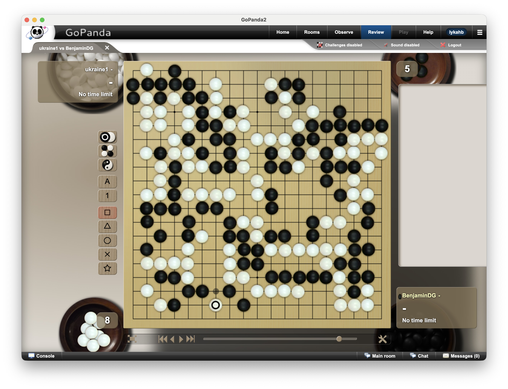

# Pandanet Tweaker

`pandanet-tweaker` lets you restyle the Pandanet desktop client with custom boards and stones.

It is built for people who want Pandanet to look more like the Go software they already enjoy, especially when they have a favorite Sabaki theme they want to carry over. Instead of manually digging through app files, the tool takes a theme or a few image files and builds a patched Pandanet app bundle for you.

The tool aims to support the most recent Pandanet desktop client version first. When the client changes, compatibility updates should target the newest release before older builds.

On macOS, the installed Pandanet bundle lives at:

`/Applications/GoPanda2.app/Contents/Resources/app.asar`

To open that app directory in Finder, open `/Applications`, right-click `GoPanda2.app`, and choose `Show Package Contents`.

For repeatable theming on macOS, keep the clean upstream archive alongside it as:

`/Applications/GoPanda2.app/Contents/Resources/original-app.asar`

The project is built with Python and `uv`, but the product goal is simple: make Pandanet theming practical, repeatable, and reversible without turning the tool into a general-purpose app patcher.

## Scope

- Accept direct file inputs for:
  - background
  - black stone
  - white stone
- Optionally import a theme package, starting with Sabaki-compatible themes.
- Normalize those inputs into a small internal manifest with semantic roles:
  - `board`
  - `stone-black`
  - `stone-white`
- Copy those assets into the patched archive and redirect Pandanet's CSS/JS references to them.
- Patch the client CSS so the goban board texture can either repeat or scale.
- Optionally tint the goban grid canvas with a CSS filter derived from a target RGBA color.
- Rebuild a new `.asar` directly from the source archive while overwriting only the files the tool changes.

Current implementation status lives in [docs/plan.md](/Users/borys/projects/pandanet-tweaker/docs/plan.md:1). Lower-level asset and rendering notes live in [docs/pandanet-assets.md](/Users/borys/projects/pandanet-tweaker/docs/pandanet-assets.md:1).

## Screenshot



*BadukTV theme, fuzzy stone placement. Generated with `uv run pandanet-tweaker replace --fuzzy-stone-placement 0.04 --stone-scale=0.97 ~/Downloads/Upsided-Sabaki-Themes-main/baduktv`.*

## CLI

Inspect a theme:

```bash
uv run pandanet-tweaker inspect-theme /path/to/theme
```

Build a dry-run plan from direct asset files:

```bash
uv run pandanet-tweaker replace \
  --board-background /path/to/board.svg \
  --board-background-mode scale \
  --black-stone /path/to/black.svg \
  --white-stone /path/to/white.svg \
  --stone-scale 1.1 \
  --grid-rgba '#c58a3ccc' \
  --fuzzy-stone-placement 0.08 \
  --disable-default-shadows \
  --dry-run
```

Use a Sabaki theme, but override just one asset:

```bash
uv run pandanet-tweaker replace /path/to/theme \
  --board-background /path/to/custom-board.svg \
  --board-background-mode repeat \
  --dry-run
```

Repack to a new output file:

```bash
uv run pandanet-tweaker replace \
  --board-background /path/to/board.svg \
  --board-background-mode scale \
  --black-stone /path/to/black.svg \
  --white-stone /path/to/white.svg \
  --output ./build/app.asar
```

When `--asar` is omitted, the tool looks for `/Applications/GoPanda2.app/Contents/Resources/original-app.asar` first and falls back to `app.asar`. On Linux, pass `--asar` explicitly to the `app.asar` inside the extracted AppImage tree.

If you want to skip extracting the whole archive to the filesystem first, enable direct ASAR rebuild:

`replace` now always rebuilds the output ASAR directly from the source archive. It stages only the files the tool patches, overwrites those paths in a new archive, and leaves the installed Pandanet bundle untouched unless you replace the output yourself.

This flow is meant to start from a clean `original-app.asar` source. If you point it at an already patched archive, old extra files from earlier theme runs can remain in the output because the tool overwrites files but does not delete stale custom paths from the source archive.

## Install Into App

By default, the tool writes the patched archive to `build/app.asar`.

### macOS

On macOS, `build/app.asar` is ready for Finder replacement.

Before using the tool for the first time, preserve the original archive in Finder:

1. Quit GoPanda.
2. In Finder, open `/Applications`.
3. Right-click `GoPanda2.app` and choose `Show Package Contents`.
4. Open `Contents/Resources`.
5. Rename `app.asar` to `original-app.asar`.
6. Keep `original-app.asar` in that folder.

After generating `build/app.asar`, install the themed archive in Finder:

1. Open `/Applications/GoPanda2.app/Contents/Resources`.
2. Copy `build/app.asar` into that folder.
3. Replace the existing `app.asar`.

This keeps the clean base archive available, so the tool always rebuilds from the original app instead of stacking one theme patch on top of another.

Using Finder is the simplest path on macOS because terminal writes into app bundles under `/Applications` can be blocked by system privacy controls even when normal file permissions look correct.

### Linux

The Linux Pandanet client in this repository is distributed as `GoPanda2.AppImage`, which is a type-2 x86-64 AppImage with a built-in `--appimage-extract` mode. The practical Linux flow is: extract the AppImage, patch the extracted `app.asar`, then optionally rebuild a new AppImage.

Before using the tool for the first time on Linux:

1. Make the AppImage executable: `chmod +x GoPanda2.AppImage`
2. Extract it in place: `./GoPanda2.AppImage --appimage-extract`
3. Locate the Electron archive inside the extracted tree: `find squashfs-root -name app.asar`
4. Copy that archive to a preserved clean source next to it: `cp /path/to/app.asar /path/to/original-app.asar`

Build a patched archive from the extracted AppImage contents:

```bash
uv run pandanet-tweaker replace /path/to/theme \
  --asar /path/to/original-app.asar \
  --output /tmp/app.asar
```

Install the patched archive into the extracted AppImage tree:

1. Copy `/tmp/app.asar` over the extracted AppImage `app.asar` you found with `find`.
2. Keep `original-app.asar` alongside it so future runs always rebuild from the clean base archive.

At that point you have two Linux options:

1. Run the extracted application directly with `./squashfs-root/AppRun`
2. Rebuild a new AppImage from the modified extraction tree with `appimagetool squashfs-root GoPanda2-patched.AppImage`

The second step requires `appimagetool` on the Linux machine. This repository does not build AppImages itself; it only produces the patched `app.asar`.

### Windows

Windows install steps are not documented yet. Add the verified Pandanet install path and `app.asar` replacement flow here once tested against a current Windows client build.

## Repository Layout

- `README.md`: project description and usage.
- `docs/plan.md`: build plan and milestones.
- `docs/pandanet-assets.md`: Pandanet client asset inventory and target mapping notes.
- `docs/pandanet-js-patches.md`: minified `gopanda.js` patch ledger for future app upgrades.
- `src/`: Python package and CLI.
- `tests/`: initial unit tests.
- `AGENTS.md`: project-specific guidance for future coding agents.

## Development

Run the test suite:

```bash
python3 -m unittest discover -s tests -t . -v
```

## Sources

- Sabaki theme examples: <https://github.com/billhails/SabakiThemes>
  - Repository README confirms themes are installed inside Sabaki as downloadable theme files.
  - The current importer makes a conservative inference from Sabaki package structure and CSS asset references.
- Python ASAR library: <https://github.com/lykahb/asar-py>
- Pandanet app inventory:
  - Extracted from `/Applications/GoPanda2.app/Contents/Resources/app.asar` on April 18, 2026.
